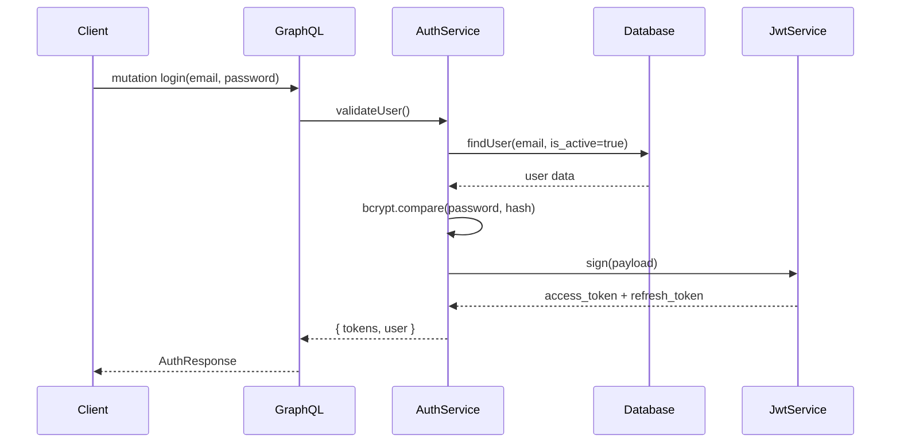
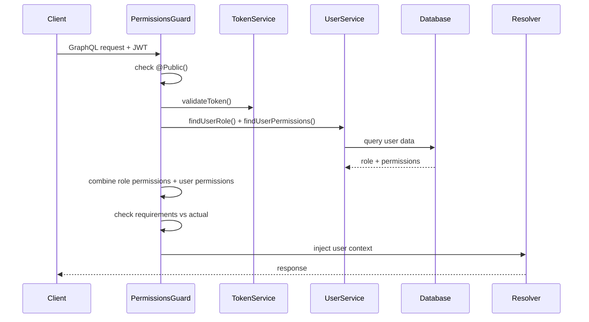

# 🏗️ Hướng Dẫn Kiến Trúc Backend

## 📋 Tổng Quan

Backend được xây dựng bằng **NestJS** với **GraphQL API**, sử dụng **Supabase** (PostgreSQL) làm database và **JWT** cho authentication. Hệ thống áp dụng kiến trúc modular với phân quyền role-based và permission-based chi tiết.

## 🎯 Kiến Trúc Chính

```
backend/
├── src/
│   ├── main.ts                 # Entry point - khởi tạo NestJS app
│   ├── app.module.ts           # Root module - kết nối tất cả modules
│   ├── app.controller.ts       # Health check controller
│   │
│   ├── config/                 # Environment configurations
│   │   ├── app.config.ts       # App settings (CORS, port, salt rounds)
│   │   ├── database.config.ts  # Supabase connection config
│   │   └── jwt.config.ts       # JWT secrets và expiration times
│   │
│   ├── decorators/             # Custom decorators
│   │   ├── current-user.decorator.ts    # @CurrentUserId() - lấy user ID từ JWT
│   │   ├── permissions.decorator.ts     # @Permissions() - yêu cầu permissions
│   │   ├── public.decorator.ts          # @Public() - bỏ qua authentication
│   │   └── roles.decorator.ts           # @Roles() - yêu cầu roles
│   │
│   ├── filters/                # Exception handling
│   │   └── all-exceptions.filter.ts    # Global error handler
│   │
│   ├── guards/                 # Authentication & Authorization
│   │   ├── permissions.guard.ts        # Main authorization guard
│   │   └── throttler.guard.ts          # Rate limiting protection
│   │
│   ├── interceptors/           # Request/Response processing
│   │   └── auth.interceptor.ts         # Token validation interceptor
│   │
│   ├── modules/                # Business logic modules
│   │   ├── auth/               # Authentication logic
│   │   ├── database/           # Supabase client wrapper
│   │   ├── jwt/                # JWT strategy and validation
│   │   └── user/               # User management CRUD
│   │
│   ├── shared/                 # Shared utilities
│   │   ├── constants/          # System constants và validation rules
│   │   ├── decorators/         # Custom validation decorators
│   │   ├── dto/                # Consolidated DTO classes
│   │   ├── entities/           # Base entity classes
│   │   ├── enums/              # Role và Permission enums
│   │   ├── services/           # Logger, token validation
│   │   ├── types/              # TypeScript type definitions (user, generic)
│   │   ├── utils/              # Helper functions
│   │   └── validators/         # Input validation utilities
│   │
│   └── schema.gql              # Auto-generated GraphQL schema
```

## 🔐 Luồng Xác Thực & Phân Quyền

### 1. Luồng Xác Thực (Authentication Flow)



### 2. Luồng Phân Quyền (Authorization Flow)



## 📊 Cấu Trúc Database

### Cấu Trúc Bảng Users

```sql
CREATE TABLE users (
  id UUID PRIMARY KEY DEFAULT gen_random_uuid(),
  email VARCHAR(255) UNIQUE NOT NULL,
  password VARCHAR(255) NOT NULL,  -- bcrypt hash
  name VARCHAR(255),
  address TEXT,
  role VARCHAR(20) NOT NULL,       -- ADMIN, MANAGER, STAFF, USER, GUEST
  permissions TEXT[],              -- Array của permission strings
  is_active BOOLEAN DEFAULT true,
  created_at TIMESTAMP DEFAULT now(),
  updated_at TIMESTAMP DEFAULT now()
);

-- Các index để tối ưu hiệu năng
CREATE INDEX idx_users_email ON users(email);
CREATE INDEX idx_users_role_active ON users(role, is_active);
CREATE INDEX idx_users_permissions ON users USING GIN(permissions);
```

## 🎭 Hệ Thống Vai Trò & Quyền Hạn

### Roles Hierarchy (từ cao xuống thấp)

| Role    | Description               | Default Permissions Count |
| ------- | ------------------------- | ------------------------- |
| ADMIN   | Toàn quyền hệ thống       | 28 (tất cả)               |
| MANAGER | Quản lý users và hệ thống | 8 quyền chính             |
| STAFF   | Nhân viên vận hành        | 3 quyền cơ bản            |
| USER    | Người dùng thông thường   | 3 quyền cá nhân           |
| GUEST   | Khách truy cập            | 0 quyền                   |

### Các Nhóm Quyền Hạn

```typescript
// 28 permissions được chia thành 4 nhóm:

// 📝 User Management (13 permissions)
;(CREATE_USER,
  READ_USER,
  UPDATE_USER_INFO,
  UPDATE_USER_PASSWORD,
  DELETE_USER,
  VIEW_ALL_USERS,
  MANAGE_USERS,
  ADMIN_UPDATE_PASSWORD)

// 👤 Role Management (3 permissions)
;(ASSIGN_ROLE, REMOVE_ROLE, VIEW_ROLES)

// 🔑 Permission Management (3 permissions)
;(ASSIGN_PERMISSION, REMOVE_PERMISSION, VIEW_PERMISSIONS)

// ⚙️ System Administration (3 permissions)
;(SYSTEM_CONFIG, VIEW_LOGS, BACKUP_RESTORE)
```

### Logic Kết Hợp Quyền Hạn

```typescript
// Trong PermissionsGuard.canActivate()
const rolePermissions = getRolePermissions(userRole) // Từ role
const userPermissions = await findUserPermissions(userId) // Riêng của user
const allPermissions = [...new Set([...userPermissions, ...rolePermissions])]

// User có quyền nếu:
// 1. Role của user có permission đó, HOẶC
// 2. User được cấp permission riêng
```

## 🏗️ Tái Cấu Trúc & Cải Tiến Gần Đây

### Consolidated Architecture Pattern

Backend đã được refactor để áp dụng các best practices:

#### 1. **Custom Validation Decorators** (`src/shared/decorators/validation.decorators.ts`)

- `@IsStrongPassword()` - Validation mật khẩu mạnh
- `@IsValidEmail()` - Validation email với blocked list
- `@IsUserId()` - Validation UUID format
- `@IsUserName()` - Validation tên người dùng
- `@IsCurrentPassword()` - Validation mật khẩu hiện tại
- **Benefits**: Loại bỏ ~350+ lines duplicate validation code

#### 2. **Consolidated Type System** (`src/shared/types/`)

- `user.types.ts` - Single source of truth cho User types
- `generic.types.ts` - Utility types cho reusability
- **Benefits**: Type safety và consistency across toàn bộ codebase

#### 3. **Base DTO Pattern** (`src/shared/dto/`)

- `base.dto.ts` - Base classes cho tất cả DTOs
- `user.dto.ts` - Consolidated User DTOs
- `auth.dto.ts` - Consolidated Auth DTOs
- **Benefits**: Standardized response patterns và pagination

#### 4. **Centralized Validation Rules** (`src/shared/constants/validation.constants.ts`)

- Password patterns và rules
- Email validation rules
- GraphQL field descriptions
- **Benefits**: Single source of truth cho validation logic

## 🔧 Phân Tích Chi Tiết Các Service Cốt Lõi

### 1. AuthService (`src/modules/auth/auth.service.ts`)

**Chức năng chính:**

- `validateUser()`: Xác thực email/password với bcrypt
- `login()`: Tạo JWT access token (15-30 phút) + refresh token (7-30 ngày)
- `refreshToken()`: Làm mới tokens khi hết hạn
- `revokeToken()`: Thu hồi refresh token (đăng xuất)

**Tính Năng Bảo Mật:**

- Bcrypt password hashing với configurable salt rounds
- JWT payload chứa user info + permissions để giảm database queries
- Separate token types (access vs refresh)
- Comprehensive audit logging

### 2. PermissionsGuard (`src/guards/permissions.guard.ts`)

**Quy Trình Làm Việc Chi Tiết:**

1. **Public Check**: Bỏ qua nếu có `@Public()` decorator
2. **Token Extraction**: Lấy token từ `Authorization: Bearer <token>`
3. **JWT Validation**: Verify signature, expiration, type
4. **Requirements Reading**: Đọc `@Permissions()` và `@Roles()` từ resolver
5. **Database Lookup**: Query user's current role + permissions
6. **Permission Calculation**: Combine role permissions + individual permissions
7. **Access Decision**: Compare requirements vs actual permissions
8. **Context Injection**: Gắn user info vào request cho resolvers

### 3. UserService (`src/modules/user/user.service.ts`)

**Các Thao Tác CRUD:**

- `create()`: Tạo user mới với validation
- `findAllPaginated()`: Danh sách users với pagination, search, và filters
- `findOne()`: Thông tin user theo ID
- `updateUserInfo()`: Cập nhật profile
- `remove()`: Soft delete (set is_active = false)

**Quản Lý Mật Khẩu:**

- `updatePassword()`: User đổi mật khẩu (cần mật khẩu cũ)
- `adminUpdatePassword()`: Admin reset mật khẩu (không cần mật khẩu cũ)
- Kiểm tra độ mạnh mật khẩu
- Bcrypt hashing với salt rounds

**Tính Năng Bảo Mật:**

- Input sanitization để prevent XSS
- Email normalization và validation
- UUID validation
- Access control (user chỉ được sửa data của mình)

### 4. DatabaseService (`src/modules/database/database.service.ts`)

**Wrapper cho Supabase Client:**

- Cấu hình từ biến môi trường
- Xác thực kết nối
- Các thao tác database type-safe
- Xử lý lỗi

## 📡 Tài Liệu Tham Khảo GraphQL API

### Các Truy Vấn (Queries)

```graphql
# Lấy thông tin user hiện tại
query GetCurrentUser {
  user {
    id
    email
    name
    role
    permissions
  }
}

# Admin: Danh sách tất cả users (Legacy)
query GetAllUsers {
  # Requires: Permission.VIEW_ALL_USERS
  users {
    id
    email
    name
    role
    is_active
    created_at
  }
}

# Admin: Danh sách users với pagination (Recommended)
query GetUsersPaginated($query: UserQueryInput) {
  # Requires: Permission.VIEW_ALL_USERS
  usersPaginated(query: $query) {
    success
    message
    data {
      id
      email
      name
      role
      is_active
      created_at
    }
    pagination {
      currentPage
      limit
      total
      totalPages
      hasPrevious
      hasNext
    }
  }
}

# Admin/Manager: Thông tin user theo ID
query GetUserById($id: String!) {
  # Requires: Permission.VIEW_ALL_USERS
  userById(id: $id) {
    id
    email
    name
    role
    permissions
  }
}
```

### Các Thay Đổi (Mutations)

```graphql
# Public: Đăng ký tài khoản
mutation Register($input: CreateUserInput!) {
  register(createUserInput: $input) {
    id
    email
    name
  }
}

# Public: Đăng nhập
mutation Login($input: LoginInput!) {
  login(input: $input) {
    access_token
    refresh_token
    user {
      id
      email
      name
      role
      permissions
    }
  }
}

# Admin: Tạo user mới
mutation CreateUser($input: CreateUserInput!) {
  # Requires: Permission.CREATE_USER
  createUser(createUserInput: $input) {
    id
    email
    role
  }
}

# User: Cập nhật thông tin cá nhân
mutation UpdateUserInfo($input: UpdateUserInfoInput!) {
  # Requires: Permission.UPDATE_USER_INFO
  updateUserInfo(updateUserInfoInput: $input) {
    id
    name
    email
    address
  }
}

# User: Đổi mật khẩu
mutation UpdatePassword($input: UpdateUserPasswordInput!) {
  # Requires: Permission.UPDATE_USER_PASSWORD
  updateUserPassword(updateUserPasswordInput: $input)
}
```

## 🛡️ Security Best Practices

### 1. JWT Security

- **Short-lived access tokens** (15-30 phút) để giảm thiểu risk khi bị compromise
- **Long-lived refresh tokens** (7-30 ngày) để user không phải đăng nhập liên tục
- **Token type validation** để prevent refresh token được dùng như access token
- **JTI (JWT ID)** để có thể revoke tokens trong tương lai

### 2. Password Security

- **Bcrypt hashing** với configurable salt rounds (default: 12)
- **Password strength validation**: ít nhất 8 ký tự, có số, chữ hoa, ký tự đặc biệt
- **Current password verification** khi đổi mật khẩu
- **Admin password reset** với additional authorization checks

### 3. Input Validation

- **Class-validator decorators** cho GraphQL inputs
- **Email normalization** (trim, lowercase)
- **XSS prevention** với input sanitization
- **UUID validation** cho IDs
- **Blocked email list** để prevent test accounts

### 4. Database Security

- **Parameterized queries** với Supabase client (prevent SQL injection)
- **Soft delete** thay vì hard delete để maintain audit trail
- **Database indexes** cho performance và security
- **Active user filtering** trong mọi queries

## 📊 Logging & Monitoring

### Winston Logger Configuration

```typescript
// Trong LoggerService
const logger = winston.createLogger({
  level: 'debug',
  format: winston.format.combine(
    winston.format.timestamp(),
    winston.format.json(),
  ),
  transports: [
    new winston.transports.DailyRotateFile({
      filename: 'logs/app-%DATE%.log',
      datePattern: 'YYYY-MM-DD',
      maxSize: '20m',
      maxFiles: '14d',
    }),
    new winston.transports.DailyRotateFile({
      filename: 'logs/error-%DATE%.log',
      level: 'error',
    }),
  ],
})
```

### Log Categories

1. **Authentication Events**
   - Login attempts (success/failure)
   - Token refresh/revoke
   - Password changes

2. **Authorization Events**
   - Permission checks
   - Access granted/denied
   - Role changes

3. **Database Operations**
   - User CRUD operations
   - Query performance
   - Connection issues

4. **System Events**
   - Application startup
   - Configuration changes
   - Errors and exceptions

## 🚀 Development & Deployment

### Environment Variables

```bash
# Database
SUPABASE_URL=https://your-project.supabase.co
SUPABASE_SERVICE_ROLE_KEY=your-service-role-key

# JWT
JWT_SECRET=your-super-secret-jwt-key

# App Configuration
SERVER_PORT=9703
FRONTEND_URL=http://localhost:3000
NODE_ENV=development

# Security
BCRYPT_SALT_ROUNDS=12
```

### Development Commands

```bash
# Development
npm run start:dev        # Start with watch mode
npm run build           # Build for production
npm run start:prod      # Start production server

# Code Quality
npm run lint            # ESLint with auto-fix
npm run format          # Prettier formatting

# Testing
npm run test            # Unit tests
npm run test:watch      # Tests in watch mode
npm run test:cov        # Coverage report
npm run test:e2e        # End-to-end tests
```

### Docker Deployment

```dockerfile
FROM node:18-alpine
WORKDIR /app
COPY package*.json ./
RUN npm ci --only=production
COPY dist ./dist
EXPOSE 9703
CMD ["node", "dist/main"]
```

## 🔍 Troubleshooting Guide

### Common Issues

1. **"User không đủ quyền"**
   - Kiểm tra user role trong database
   - Verify permissions được assign đúng
   - Check decorator requirements trên resolver

2. **"Token không hợp lệ"**
   - Verify JWT_SECRET trong environment
   - Check token expiration
   - Ensure đang dùng access token (không phải refresh token)

3. **"Database connection failed"**
   - Verify SUPABASE_URL và SUPABASE_SERVICE_ROLE_KEY
   - Check network connectivity
   - Validate Supabase project status

4. **Performance Issues**
   - Enable database query logging
   - Check missing indexes
   - Monitor token validation overhead

### Debug Commands

```bash
# View logs
tail -f logs/app-$(date +%Y-%m-%d).log

# Database connection test
npm run test:e2e -- --grep "database"

# Token validation test
curl -H "Authorization: Bearer YOUR_TOKEN" \
     -H "Content-Type: application/json" \
     -d '{"query":"query { user { id } }"}' \
     http://localhost:9703/graphql
```

## 📚 Additional Resources

- [NestJS Documentation](https://docs.nestjs.com/)
- [GraphQL Best Practices](https://graphql.org/learn/best-practices/)
- [Supabase Docs](https://supabase.com/docs)
- [JWT.io](https://jwt.io/) - JWT debugger
- [bcrypt Online Tool](https://bcrypt-generator.com/) - Password hash generator

---

_Tài liệu này được cập nhật thường xuyên. Nếu có thắc mắc về architecture, hãy liên hệ Backend Team._
